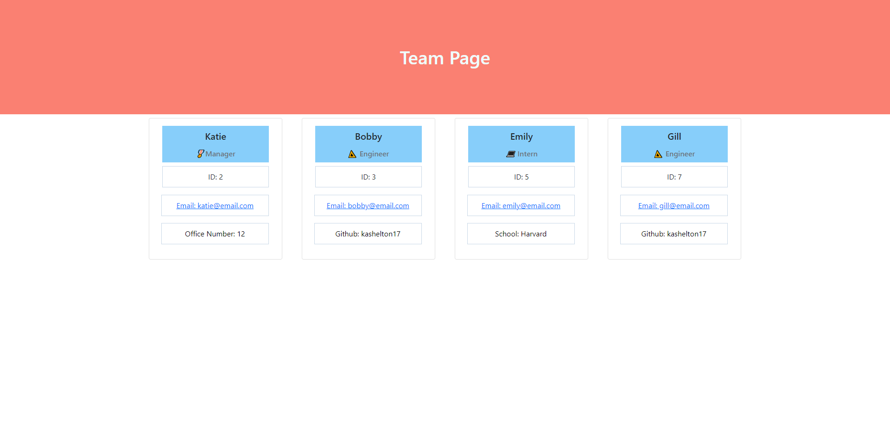
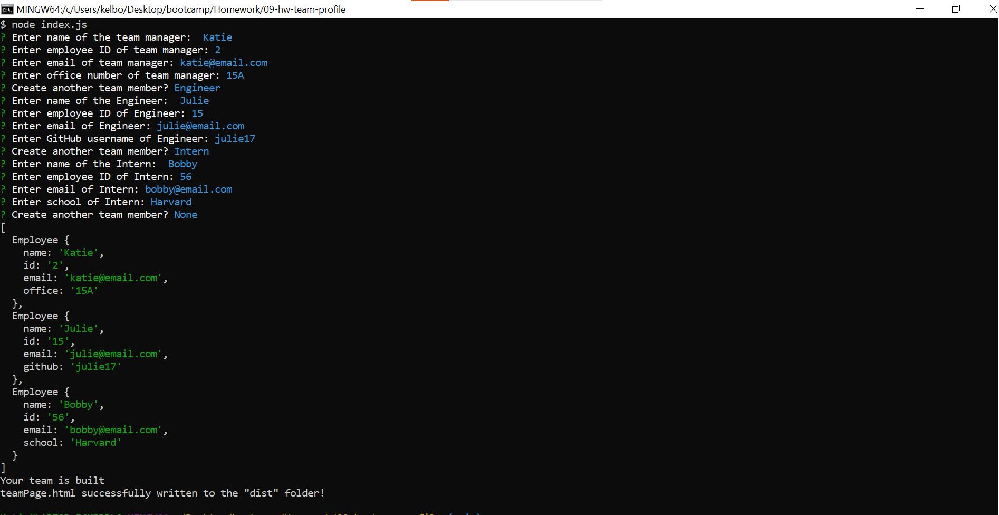

# TeamGenerator 
 

 
 ## Description 
 This application generates an html page based on the input of a user that displays a team with a Employee objects and their information 
 
 

 
 ## Table of Contents 

 * [Installation](#installation) 

 * [Usage](#usage) 

 * [License](#license) 

 * [Contributing](#contributing) 

 * [Tests](#Tests) 

 * [Questions](#questions)

 
 ## Installation 
Fork or download the repository then run npm i to install all dependencies

 
 ## Usage 
 to use type in 'node index.js' and the application will start

 
 ## License 
 This application uses a license from MIT 
  
 * Link: https://opensource.org/licenses/MIT

 
 ## Contributing 
 None

 
 ## Tests 
 run npm test to run tests and view all tests in the __tests__ folder

 
 ## Questions 
 Please find me on GitHub or email me with further questions:

 * GitHub: [kashelton17](https://github.com/kashelton17)

 * Email: kashelton17@gmail.com 
